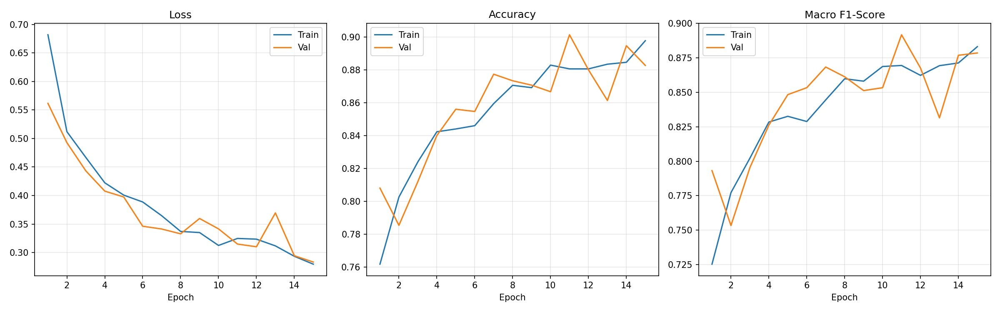
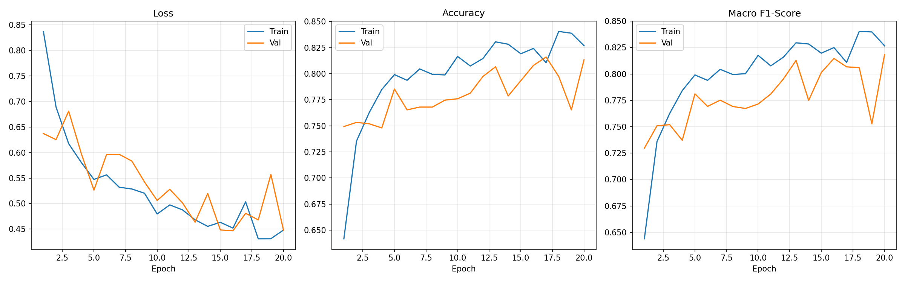
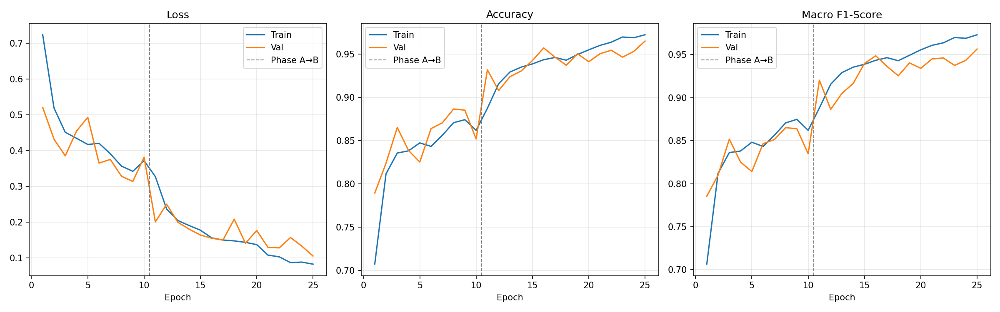
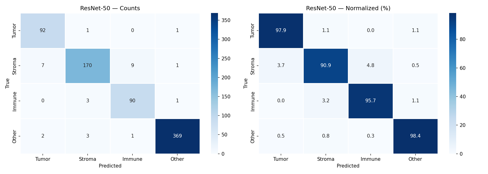
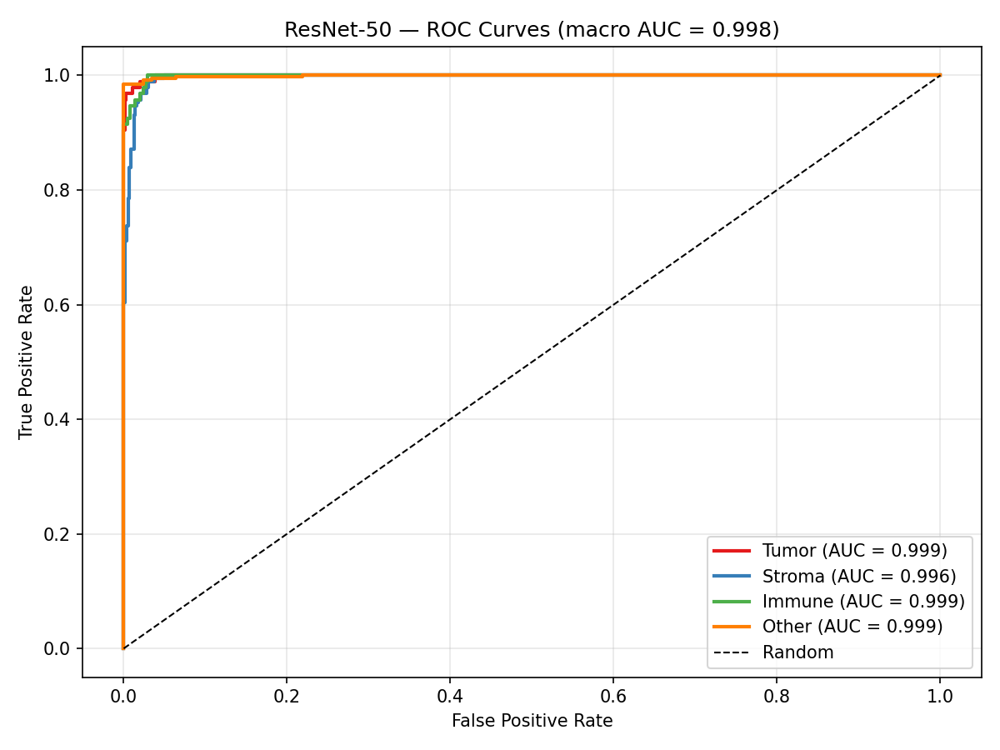

# Biomedical Image Classification for Pathology Screening

Colorectal cancer tissue classification using the Kather 2016 histology dataset.  
Three models are compared: a naive CNN baseline, an augmented CNN baseline, and ResNet-50 transfer learning.

---

## Project Overview

Digital pathology workflows require rapid, consistent screening of tissue slides.
This project trains classifiers that map 150×150 px histology tile images into
four clinically meaningful categories — **Tumor, Stroma, Immune, Other** — using
the publicly available Kather et al. 2016 dataset (5,000 images, 8 tissue classes).

The three-way comparison is designed to isolate what actually drives performance gains:

| Model | What it tests |
|---|---|
| **Baseline CNN (Simple)** | Raw model capacity — no augmentation, no class rebalancing |
| **Baseline CNN (Augmented)** | Same depth + augmentation + weighted sampling |
| **ResNet-50** | Pretrained ImageNet features + two-phase fine-tuning |

---

## Dataset

**Kather Texture 2016 — Colorectal Cancer Histology**  
Source: [Zenodo record 53169](https://zenodo.org/records/53169) (~1.2 GB)

- **5,000 images** — 150×150 px, RGB, `.tif`
- **8 original tissue classes** mapped to **4 screening categories**

### Class Mapping

| Original Class | Category | Clinical Meaning |
|---|---|---|
| `01_TUMOR` | **Tumor** | Malignant epithelial cells |
| `02_STROMA`, `03_COMPLEX` | **Stroma** | Tumor microenvironment |
| `04_LYMPHO` | **Immune** | Lymphocyte infiltrate (prognostic marker) |
| `05_DEBRIS`, `06_MUCOSA`, `07_ADIPOSE`, `08_EMPTY` | **Other** | Non-diagnostic tissue |

### Stratified Split

| Split | Images | Tumor | Stroma | Immune | Other |
|---|---|---|---|---|---|
| Train (70%) | 3,500 | 437 | 876 | 437 | 1,750 |
| Val (15%)   | 750   | 94  | 187 | 94  | 375   |
| Test (15%)  | 750   | 94  | 187 | 94  | 375   |

All splits use the same seed (42) so test sets are identical across models.

---

## Models

### Baseline CNN — Simple (`BaselineCNNSimple`)

Intentionally minimal: no augmentation, no class rebalancing, no scheduler.  
Shows what a plain small CNN achieves without any data-side tricks.

```
Conv2d(3,16)  → BatchNorm → ReLU → MaxPool(2)
Conv2d(16,32) → BatchNorm → ReLU → MaxPool(2)
Conv2d(32,64) → BatchNorm → ReLU → AdaptiveAvgPool(1)
Flatten → Linear(64, 4)
```

- **24,068 parameters**
- 15 epochs, Adam (lr=1e-3), plain CrossEntropyLoss
- Transforms: `Resize(224) → ToTensor → Normalize`

### Baseline CNN — Augmented (`BaselineCNN`)

Heavier filters, heavy data augmentation, class-weighted loss, and LR scheduling.

```
Conv2d(3,32)   → ReLU → MaxPool(2)
Conv2d(32,64)  → ReLU → MaxPool(2)
Conv2d(64,128) → ReLU → AdaptiveAvgPool(1)
Flatten → Linear(128, 4)
```

- **93,764 parameters**
- 20 epochs, Adam (lr=1e-3), ReduceLROnPlateau, CrossEntropyLoss + class weights
- Training augmentation: `RandomResizedCrop(224)`, flips, `RandomRotation(90)`, `ColorJitter`
- WeightedRandomSampler to compensate for class imbalance

### ResNet-50 Transfer Learning (`ResNet50Classifier`)

Pretrained ImageNet backbone with a custom 4-class head, trained in two phases:

```
Linear(2048, 512) → ReLU → Dropout(0.3) → Linear(512, 4)
```

| Phase | Epochs | Trainable params | LR |
|---|---|---|---|
| A — head only | 1–10 | 1,051,140 | 1e-3 |
| B — layer4 + head | 11–25 | 16,015,876 | 1e-4 |

- Adam, ReduceLROnPlateau, CrossEntropyLoss + class weights, mixed precision (AMP)

---

## Results

### 3-Way Test Set Comparison

| Metric | Baseline (Simple) | Baseline (Aug) | ResNet-50 |
|---|---|---|---|
| **Accuracy** | 89.2% | 84.3% | **96.1%** |
| **Macro F1** | 0.882 | 0.843 | **0.948** |
| Weighted F1 | 0.890 | 0.845 | 0.961 |
| Macro AUC-ROC | 0.986 | 0.974 | **0.998** |

**ResNet-50 F1 improvement over naive baseline: +7.5% relative (+0.066 absolute)**

### Per-Class F1

| Class | Baseline (Simple) | Baseline (Aug) | ResNet-50 |
|---|---|---|---|
| Tumor  | 0.835 | 0.867 | 0.944 |
| Stroma | 0.840 | 0.792 | 0.934 |
| Immune | 0.936 | 0.849 | 0.928 |
| Other  | 0.917 | 0.866 | **0.988** |

> Note: The simple baseline outperforms the augmented baseline because it includes
> BatchNorm on every conv layer (the augmented CNN has none), which stabilises
> training independently of data augmentation.

### Training Curves

| Baseline (Simple) | Baseline (Aug) | ResNet-50 |
|---|---|---|
|  |  |  |

### ResNet-50 — Confusion Matrix & ROC Curves

| Confusion Matrix | ROC Curves |
|---|---|
|  |  |

---

## Reproducing Results

### 1. Setup

```bash
git clone https://github.com/sanket66666/Biomedical-Image-CL-for-Pathology-Screening
cd Biomedical-Image-CL-for-Pathology-Screening
python -m venv venv
source venv/bin/activate        # Windows: venv\Scripts\activate
pip install -r requirements.txt
```

### 2. Download Dataset

```bash
python -m src.download_data
# Downloads ~1.2 GB from Zenodo and extracts to data/
```

### 3. Train

```bash
# Naive simple baseline (15 epochs, ~3 min on RTX 4050)
python main.py --model baseline_simple

# Augmented baseline (20 epochs, ~10 min)
python main.py --model baseline

# ResNet-50 two-phase fine-tuning (25 epochs, ~12 min)
python main.py --model resnet50
```

Each command trains the model, runs evaluation on the test set, and saves all
plots + metrics to the corresponding `experiments/` subdirectory.

### 4. Evaluate independently

```bash
# Single model
python -m src.evaluate --model baseline_simple
python -m src.evaluate --model resnet

# Full 3-way comparison table
python -m src.evaluate --model all
```

### Environment

Tested on Windows 11, Python 3.12, PyTorch 2.x, RTX 4050 6 GB VRAM.  
All random seeds fixed to 42 for full reproducibility.

---

## Repository Structure

```
.
├── main.py                    # Unified train + eval entry point
├── src/
│   ├── config.py              # Hyperparams, paths, class mapping, transforms
│   ├── dataset.py             # Dataset, splits, WeightedRandomSampler, baseline loader
│   ├── model.py               # BaselineCNNSimple, BaselineCNN, ResNet50Classifier
│   ├── train.py               # Training loops for all three models
│   ├── evaluate.py            # Metrics, plots, 3-way comparison table
│   └── download_data.py       # Zenodo downloader
├── experiments/
│   ├── baseline_cnn_simple/   # Simple baseline: model, history, plots
│   ├── baseline_cnn/          # Augmented baseline: model, history, plots
│   ├── resnet50_finetuned/    # ResNet-50: model, history, plots
│   └── comparison_table.csv   # 3-way results table
├── requirements.txt
└── README.md
```

---

## Citation

Kather JN, Weis CA, Bianconi F, Melchers SM, Schad LR, Gaiser T, Marx A,
Zöllner FG. *Multi-class texture analysis in colorectal cancer histology.*
**Scientific Reports** 6, 27988 (2016).  
https://doi.org/10.1038/srep27988
